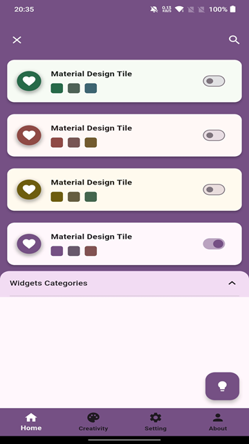
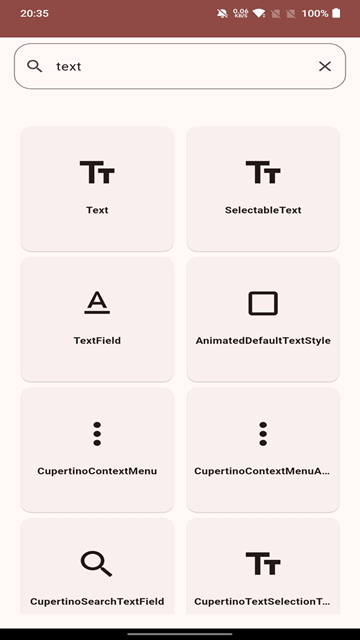
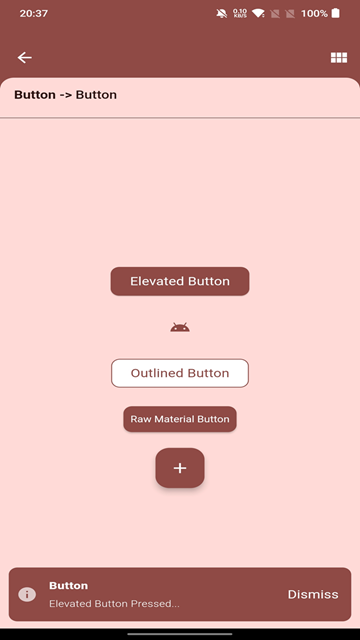

# FlutterVerse (WidgetGallery) Cookbook

## Introduction

Welcome to the FlutterVerse Cookbook! This cookbook contains a collection of recipes and resources to help you get started with contributing to the FlutterVerse app. Whether you're a beginner or an experienced Flutter developer, you'll find useful tips, tricks, and guidelines here to collaborate effectively on this project.

## Getting Started

### Prerequisites

Before you begin, ensure you have met the following requirements:

- Install Flutter by following the instructions in the [official Flutter documentation](https://flutter.dev/docs/get-started/install).
- Set up your development environment for Flutter by following the instructions in the [Flutter documentation](https://flutter.dev/docs/get-started/editor?tab=vscode).
- Have a basic understanding of Git and GitHub for version control and collaboration.

### Installation

To get started with the FlutterVerse app:

1. Clone the repository:

```
git clone https://github.com/flutterverse/flutterverse.git
```

2. Navigate to the project directory:

```
cd flutterverse
```

3. Install dependencies:

```
flutter pub get
```

4. Run the app:

```
flutter run
```


### Contributing

If you're interested in contributing to FlutterVerse, here's how you can get involved:

1. Fork the repository on GitHub.
2. Clone your forked repository to your local machine.
3. Create a new branch for your feature or bug fix:

```
git checkout -b feature-name
```

4. Make your changes and ensure they follow the project's coding guidelines and best practices.
5. Test your changes thoroughly.
6. Commit your changes with descriptive commit messages:

```
git commit -m "Add feature X"
```

7. Push your changes to your forked repository:

```
git push origin feature-name
```

8. Open a pull request on the original repository and describe your changes in detail.

### Resources

- [Flutter Documentation](https://flutter.dev/docs): Official documentation for Flutter development.
- [Flutter Widgets Catalog](https://flutter.dev/docs/development/ui/widgets): Explore Flutter widgets and their usage.
- [GitHub Help](https://docs.github.com/en): Learn more about Git and GitHub.

## Conclusion

Thank you for considering contributing to FlutterVerse! Your contributions are valuable and will help make FlutterVerse even better. If you have any questions or need assistance, feel free to reach out to us on GitHub.

Happy coding!

## Screenshots











